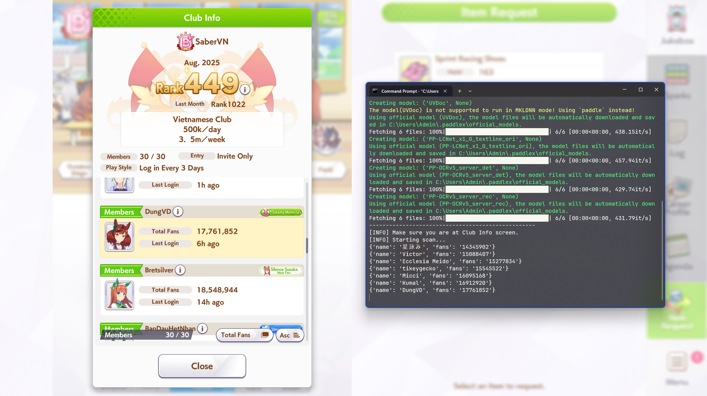

# Umamusume Club OCR

This is a simple script for extracting member names and total fans from clan members in Umamusume.

**Note:** Only work with the Steam version of the game.



## Features

- Automatically captures the club member list from the game window.
- Extracts member names and fan counts from the captured image.
- Saves the extracted data to a timestamped CSV file.
- Automatically scrolls through the member list.
- Works with both fullscreen and windowed mode.

## Prerequisites

- Python 3.8.x - 3.12.x.
- The packages listed in `requirements.txt`.

## Installation

1. Clone the repository:

    ```bash
    git clone https://github.com/dungvd0309/UmaClanOCR.git
    ```

2. Install the required packages with `setup.bat` or execute this command in your terminal:

    ```bash
    pip install -r requirements.txt
    ```

## Usage

1. Navigate to the Club Info screen in Umamusume.
2. Run the `run.bat` script or execute this command in your terminal:

    ```bash
    python main.py
    ```

3. The script will activate the game window, start scanning the member list.
4. Once the scan is complete, the extracted member data will be saved to a CSV file in the `output` directory.

## Project Structure

```
.
├── ocr/                # OCR-related utilities
│   └── ocr_utils.py
├── output/             # Directory for exported CSV files
├── utils/              # Utility functions 
│   ├── display.py
│   ├── screenshot.py
│   └── window.py
├── .gitignore          # Git ignore file
├── main.py             # Main script to run the OCR tool
├── README.md           # This file
├── requirements.txt    # Python package dependencies
├── run.bat             # Batch script to run the main application
└── setup.bat           # Batch script to install dependencies
```
